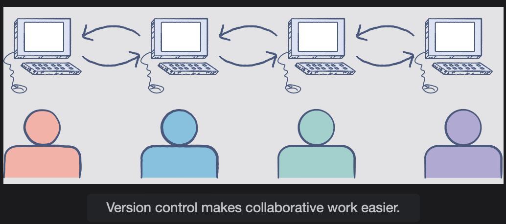

# What is Version Control?

This lesson dives into version control and explains why it is useful for large projects.

## Why do we need version control?

> Let’s say you create a project and have worked on it for over a month. While adding a new feature, you realize that something you did a week back won’t allow your new feature to work properly. You decide to revert those changes but aren’t sure if you have made similar changes in other files as well.
>
> What if there was a way for you to identify what exact changes you made and where in your code you made them? That’s where version control can help you out.

## Keep track of changes to the codebase

In the simplest of terms, you can consider version control to be a record of all the changes that your software code goes through. Version control systems allow you to keep track of how your project changes over time, with additional information about why and when each change was incorporated.

## Ease in collaborative work

Version control systems can solve many problems that you, as a developer, will face. They keep track of how your source code changes, who is changing it, and when. It also allows you to revert those changes as you deem fit.

Because of all these advantages, version control makes collaborative work easier.

If you opt not to use version control for your project, sooner or later you will find yourself copying your project directory into multiple different versions. You might name them according to whichever priority you want to assign, such as ‘final_version,’ ‘latest_version,’ or something along those lines.  
 However, it is not a sustainable approach, especially when working collaboratively with a team. Version control systems essentially formalize this process, so you don’t have to manually do it yourself.

## Version control tools

Version control tools have been continuously updated over time, following the ever-changing workflows that developers choose to use. In more recent times, Git has become the tool of choice for version control.

In the next lesson, we will look into what Git is and what makes it such a widely used software for version control.
