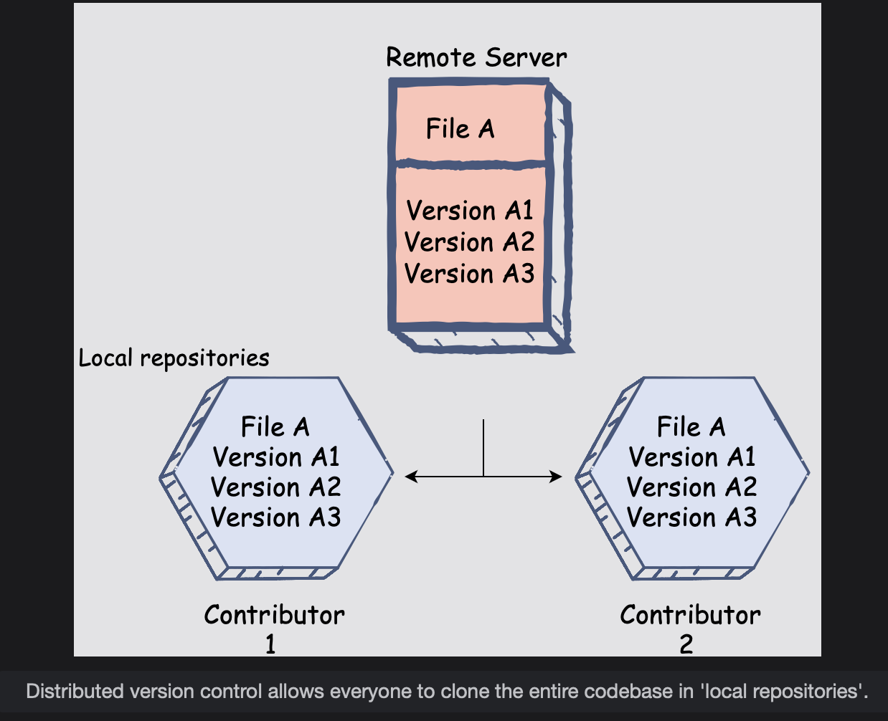
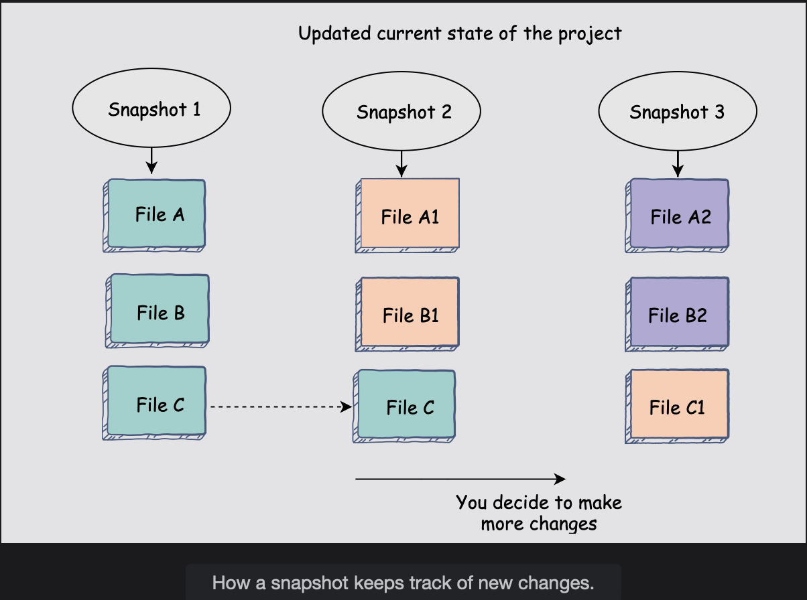
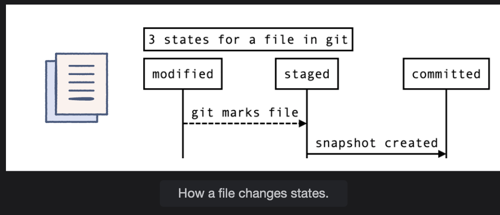

# Why is Git So Important?

In this lesson, you will learn about Git and why it's so widely used.

## What is Git?

Git is a distributed version control software. As a result, a complete copy of the entire codebase will be available on every contributor’s computer; we can also call this codebase a local repository.

Git tracks the local repository, maintains a record of all the changes that occur within it. It removes the hassle of keeping multiple versions of the project in separate directories and also makes sharing changes to the source code between collaborators seamless and quick.

The distributed nature of Git makes it unique and efficient. Since every contributor or collaborator has their own ‘clone’ of the source code in their local repository, it allows Git to track, add, or revert changes very quickly. Git uses the local database to keep a record of the changes to the project files.

#### Git snapshots

A Git snapshot is, essentially, the state of the project files at a certain point in time. In other words, instead of maintaining a record of file-based changes that occur over time, Git will store that data as a snapshot, which is the entire state of the project at that particular moment. While saving the snapshot, it will keep those files that did get updated and only keep references of files that didn’t change from the previous snapshot to avoid duplicates.

#### Git states

Git has three primary states that it allows the project’s files to acquire. The three states are:

- Modified - files that have been changed, but the changes have not yet been marked by Git. These changes won’t become part of the next snapshot.
- Staged - the changes have been tracked by Git and will be marked as such in the next snapshot.
- Committed - the changed files that have successfully become part of the latest snapshot.

Before we move on to learn more about Git, let’s briefly go over how you can use the terminal to edit text files using text editors and terminal commands.
