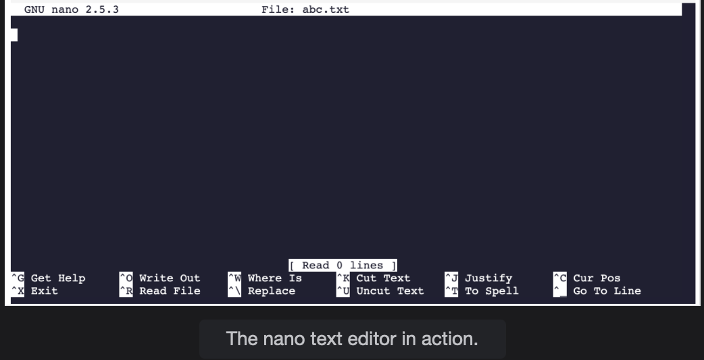

# Basic Terminal-Based Text Editors

A basic summary of how you can edit files or make changes using terminal commands or terminal-based text editors.

> We'll cover the following
>
> Using the echo command
> Using nano

The goal of this course is to cover the necessary Git commands and concepts.
To do that, we will have to alter the content of some files as we go along. We have a variety of options to opt for in this regard. Since you will be able to test out all the commands within the lessons, it’s going to be beneficial if you have an idea about how you can modify plain text files using the terminal itself.

Normally, we use fancy text editors and notepad applications, but, for this course, we will opt to use plain terminal-based commands and terminal-based text editors to make changes and updates.

## Using the echo command

We can add text to a file using the echo command which is shown below:

        echo "Hello world!" >> file1.txt

> Note: The echo command can’t be used to add text in arbitrary points in the file. It will, instead, append the text at the end of the text file.

## Using nano

nano is a very simple terminal-based text editor that comes installed as a default with Linux.

From this point forward, you will simply enter any text you plan to add to the file. By using the commands provided at the end of the terminal window, you can save those changes and exit the editor.

Note the ^ key. It represents the ctrl key on your keyboard.

- In order to get help on the commands, press ctrl + g (hold down the control key while hitting g).
- If you want to exit nano, press ctrl + x. If there are unsaved changes, nano will prompt you to save those changes before exiting.

> **Note:** The ^ is the control key on the MAC keyboard and Ctrl key on Windows.
> The image shown below is of the user interface you will encounter when you use the nano command.
>
> 
>
>           nano <file_name>

That is more or less the gist of the very basics you will need to know about terminal-based text editors for this course. Alternatively, if you are comfortable with using any other text editor such as Vim, feel free to use that as well.

In the next sections, we will continue our discussion about Git and how to configure it locally.
