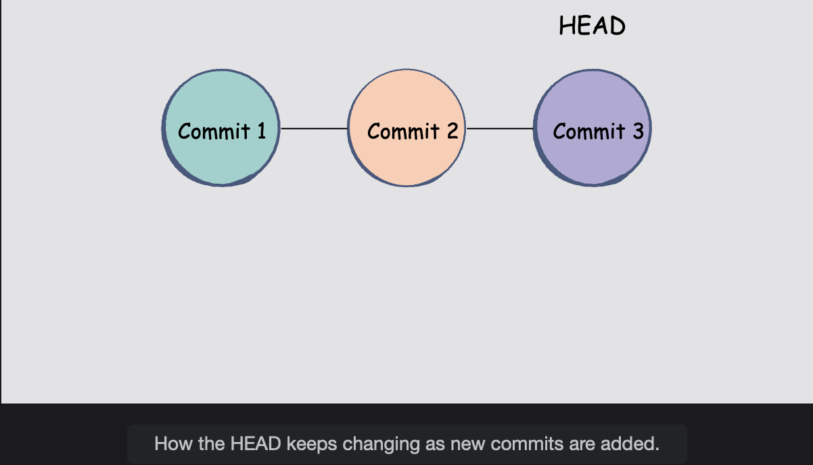

# Git Commit

Learn how to create your first snapshot with the git command.

## The git commit command

Once we have a local repository that is tracking our project, we will move towards creating our very first commit.

A Commit is a **snapshot of the entire state that your project is in at that moment. Git keeps track of your project through a series, or chain, of commits.**  
 The most recent snapshot of your repository is referred to as the **HEAD**.

As soon as you create a new commit, it will directly link to the HEAD.  
 However, since the latest commit is now the most recent one, it will considered the HEAD instead, replacing the previous one.

#### The commit message

The structure of the commit command is very straight forward:

        git commit -m "What changes ocurred within the commit"

From the snippet above, you will notice the -m flag, followed by a string. The string is called the **commit message**.  
 Usually, the **commit message is a phrase that describes what changes or modifications occurred within the commit.**

#### Our first commit

Let's move on to creating our first commit. Since it is the first one, let's have the commit message be "initial commit."

> Please note that before creating a commit, it is wise decision to use the **git status** command to check which changes will be reflected in that commit.

        git commit -m "initial commit"

The commit message can be anything you want it to be, so there is no restriction on keeping it a "initial commit."  
 The decision is up to you.  
 The **primary purpose of the commit message is to** make sure it is sufficiently descriptive, and it gives an idea of what the snapshot contains.

> **NOTE:** It is tempting to use meangingless short messages like "Commit 1", "Commit 2", etc.  
>  However, it is highly recommended NOT to do that. Descriptive commit messages can save a lot of time.

Try entering git status again and check what has changed. All the staged files become part of your initial commit, and there are no other changes to commit anymore.

You have officialy made you first commit!
