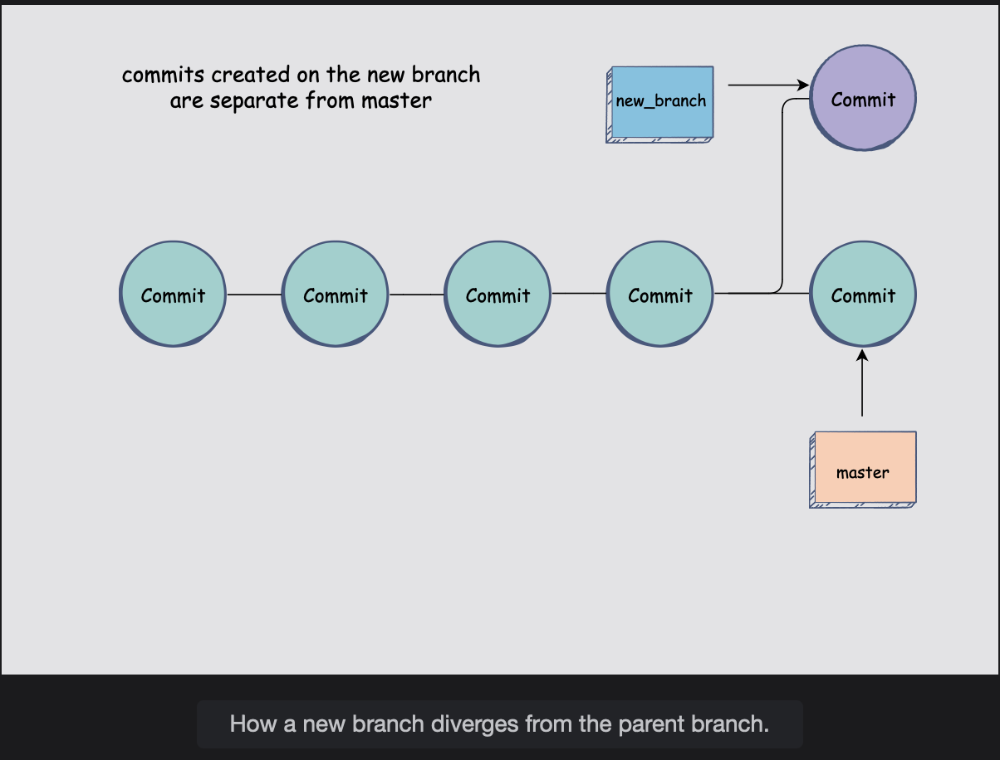
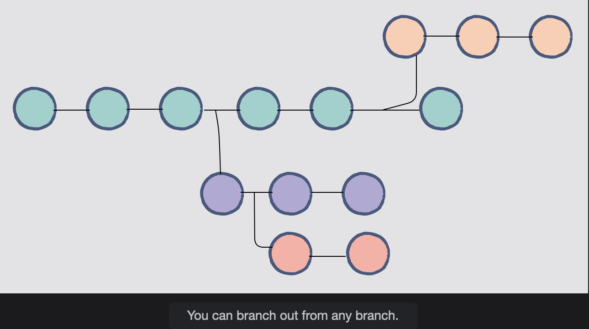

# What Is a Branch?

Learn what a branch is and how it is a central feature that allows git for making collaborative work convenient.

## Why are branches useful?

> Let’s say you are working on a project with a team. You’ve been working on a significant feature that requires a lot of changes to the codebase, and, all of a sudden, one of your team members tells you that there is a major bug, and you need to prioritize it and fix it.
>
> You will find yourself in a confusing situation. Not only will you need to switch context completely by focusing on the new issue at hand, but **where will you store all the code you have been working on for the unfinished feature?**  
>  The bug has nothing to do with the unfinished feature. Fixing the bug along with the feature is going to create a lot of confusion for everyone.

You will somehow need to go back to a state or snapshot of the source code before you started making changes to it for the feature, fix the bug, and then go back to work from where you had left off.  
 This scenario is precisely where Git branches can work in your favor.

## Branches in Git

In Git, you start with the one, **primary branch called the master**.  
 This name is the default, given to the branch the moment you create your very first commit.

All the other commits you make from that point on are made on the master branch. Git, however, allows you to create as many other branches as you like.

You can **create a separate branch that diverts away from the master and continue to do your work from there.**  
 The changes you make from that point forward and the commits you create will only be reflected in this branch and will not affect the source code in the master branch.

When you decide to create a new branch, what **Git essentially does is create a new pointer to the current snapshot or commit to your project.**  
 Therefore, the master branch has its pointer, and when you take a new branch out from the master branch, your new branch will have its pointer separate from the master.

The ability to create different branches allows you to work freely on the source code without affecting any other person’s work or the actual code in the master branch.

All the changes you make will be restricted to your branch and will not spill over to alter things you do not intend to alter.

This **also allows you to switch back and forth between contexts without having to worry about what will happen to each branch once you move to another.**  
 Git is super flexible in this regard and has made working in collaborative environments extremely easy and convenient.

## Branches out of other branches

Git lets you create a brach from any other branch.  
A new branch doesn't necessarily have to come out of the master brach.

