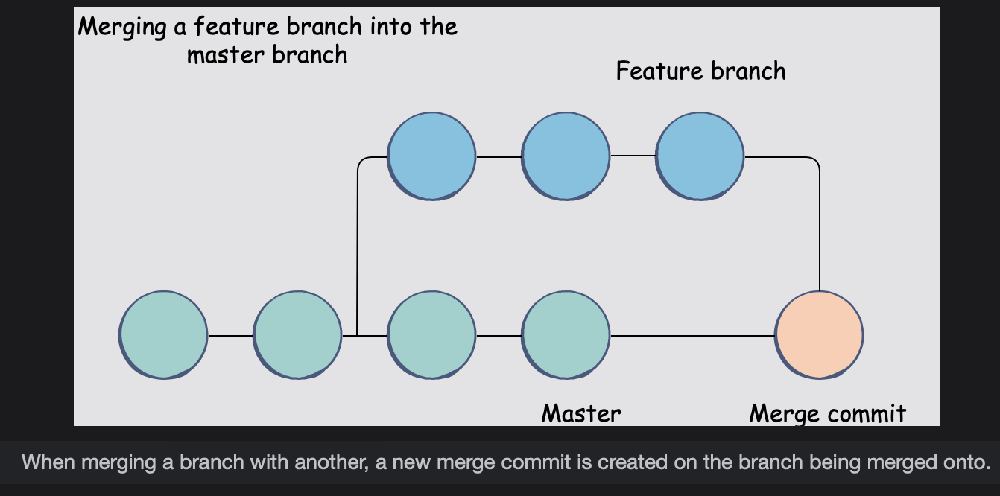

# Git Merge

> Git allows us to create separate branches and work on them independently without interference from changes in other branches. The option to create different branches enables a very convenient workstream where you, or a group of people can work on new features and ship them out only when they are complete.
>
> Creating new branches is only one part of the complete workflow.  
>  Git is a convenient version control tool because **not only can we create new branches, but we can also merge a branch with another as well**.  
>  Once we have finished working on a new feature on a separate branch, we can then merge or combine this branch into the master branch. All the changes we made in the feature branch will now be present in master as well.

## The git merge command

We can **merge a branch into another using the git merge command**.

> While the concept seems simple on the surface, there are some aspects that we should take a closer look at.  
>  When we create a new branch, the older branch more or less diverges into two separate paths from one common point, or commit in this case.
>
> Depending on which branch we are actively using, any commits we make will only be reflected in that particular branch.  
>  When we **decide to merge the two branches, the two branches will find the most recent common commit that they share**.
>
> From that point forward, the commit history will be different for both branches.  
> Git will then merge the branch into the other by creating a new merge commit for it.
>
> 

Once the merging is complete, the commit history of the merged branch will also become part of the **branch with which it merged.**  
The changes that were present only in the feature branch will also become available in the master brach as well.

## Merging a branch with the master branch

Let's try out the git merge command with a scenerio.

- You have a master branch and another branch called the **feature_branch.**
- In the master branch, you will have file1.txt, and, in the feature_branch, you will create another commit where you will add another file, file2.txt.
- Once you decide to merge the feature_branch with the master, the master branch should have both file1.txt and file2.txt.

You can verify which branch contains which files by switching to each branch and entering the terminal command ls to identify the file names.

Now, from this point forward, this is what you will need to do:

- Switch to the branch in which you want to contain the merging branch that you would like to merge.  
   For example, if we want to merge the feature_branch into the master, we will switch to the master branch so that it is the active one.  
   (Use git branch to verify which branch you are currently on.)

        git checkout master

- Now that you are using the branch that will contain the merging branch, we will move on to the git merge command.  
   The basic syntax for it is as follows:

        git merge <branch_to_be_merged>

- Therefore, for this example, we will enter the following command:

        git merge feature_branch

## Verifying after merging

You can also verify if the commit and changes from the feature_branch are accessible in the master using the commands ls and git log.
Using ls should list both file1.txt and file2.txt.

Moreover, git log should list the commits from the master branch and the feature_branch.
