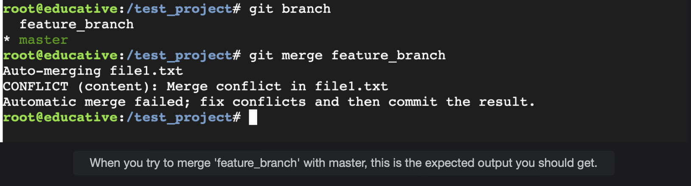

# Merge Conflicts

Learn about merge conflicts and how they occur by reading through this lesson.

## What is a merge conflict?

Merge conflicts occur, most commonly, when more than one contributor is working on a project.  
A **merge conflict takes place when a file changes at the same line in different branches or if a file is deleted in one branch, but in another, its contents are updated.**  
 When the branches are merged, Git won’t be able to infer which change it should keep and which one it should discard. At this point, it becomes necessary for a developer to resolve this merge conflict.

## How a merge conflict can occur

> Let’s look at an example of how a merge conflict can occur.
>
> We will create a new branch called feature_branch and switch over to it from master using the following command:
>
>           git checkout -b feature_branch
>
> Now that we're at the feature_branch, we will update file1.txt.
>
>           echo "Update file1 in feature_brach' > file1.txt
>
> Next, we will create a new commit and make sure that the changes in file1.txt becomes part of the snapshot by entering this command:
>
>           git commit -m 'updated contents of file 1 in feature_branch'
>
> We will then switch back ober to master and update file1.txt again:
>
>           echo "updated file1 in master" > file1.txt
>
> We will proceed to create another commit that will contain the new change but this time for the master brach.
>
>           git commit -m 'updated contents of file 1 in master'

Now that we have two branches, with both containing commits that have changes affecting the same file, we can try to see what will happen when the two branches are merged.

        git merge feature_branch

Make sure that you are currently on the master branch and that the working directory is clean and has no modified files.

If a merge conflict occurs, the image below shows what it will look like:

