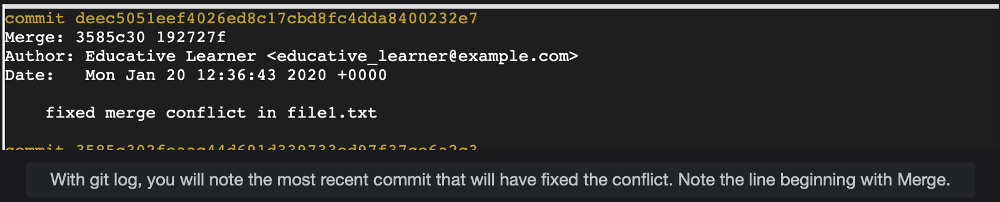

# Resolving Merge Conflicts

This lesson will teach you ways in which you can resolve merge conflicts.

> In the previous lesson, we looked at how merge conflicts can occur and worked with an example to create a merge conflict.  
>  We made changes to the same file, file1.txt, in two different branches and tried to merge them.
>
> Git can't decide on its own which changes should remain so a developer would have to resolve the conflict themselves.

## What to do when a merge conflict occurs

Merge process was haulted because of a conflict. We need to make sure that the conflict no longer exists so that the merge can be completed.

#### Identify a merge conflict in the code

We made changes to file1.txt in both branches, so what does Git view as a conflict, and how does it depict it?  
 Well, if you open up file1.txt in any text editor of your choice, you would see that the **Git has highlighted what it considers as a conflict in a syntax similar to this**.

        <<<<<<< HEAD
        =======
        >>>>>>> feature_branch

> We can try to view the contents of the file using nano, vim, or simply using **cat file_name**, and we will note that the contents of the file have somewhat changed.

> **NOTE:** Both versions of the lines will be visible only for those lines that are different in the two branches being merged.

#### Edit the file with the conflict

Now that we know where the merge conflict is, let's see what we can do to fix the issue. The conflict in file1.txt occurred because both branches had modified the text in it, and Git isn't sure which version to keep.  
 The changes that each branch made are separated by line:

        ========

It is up to us to decide which change should be kept. Since we are still on the master brach, we can proceed with keeping the text:

        Updated file1 in master

#### Resume the merge process

Now that we have updated file1.txt, we can proceed with making sure that the feature_branch is officially merged with the master.  
 From this point on, the process is fairly straightforward.  
 While making the necessary changes to the file, we inevitably modified it.  
 Therefore, we will need to make sure Git marks these changes and adds file1.txt to a staged state. We can do that with the command:

        git add file1.txt

Now, we simply need to create a new snapshot or commit that will contain our new changes.

        git commit -m 'fixed merge conflict in file1.txt'

You can verify that the merge worked by viewing the contents of file1.txt and also by using git log.  
 The most recent commit will contain a special line that tells us that this was a merge commit. **It will begin with the word Merge.**

> Here's an example output of what you can expect to see for a merge commit using git log:
>
> 

## Summary

And there you have it. You should now have a fairly good idea of what to do when a merge conflict arises.

- Update the files that contain the conflicts
- Use git add to add the updated file to staging
- Create a new commit that contains the files which have been updated to resolve the conflicts
