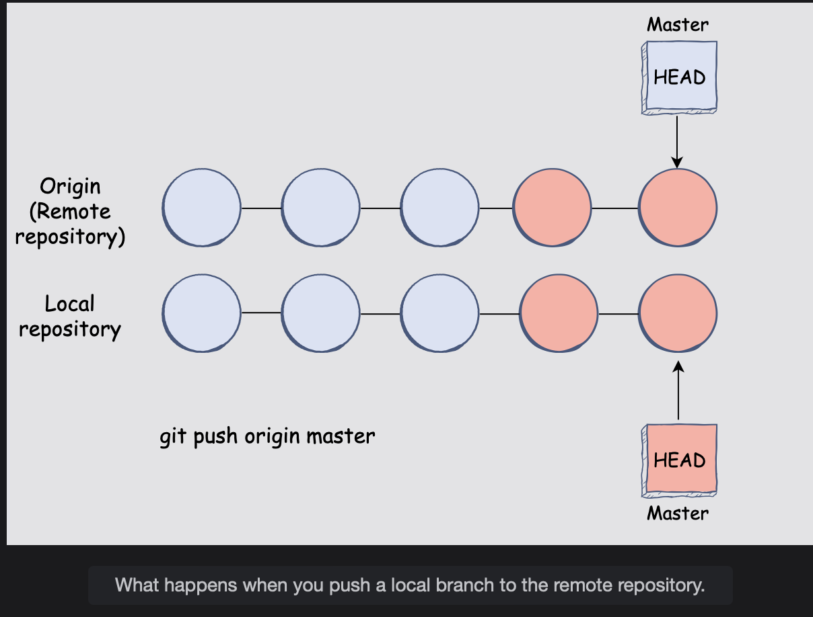

# Pushing Code to GitHub

Learn how to push your code present in the local repository to GitHub.

> When you create a remote repository on GitHub, it will initially be empty. You will need a way to get your local repository to the remote repository on GitHub.
>
> Git provides a convenient way to make this happen:
>
> - You will need to add the link of the remote repository to a local repository.
> - You will then push your code in the local repository to the remote one.

The **git remote and git push commands let us do this**, respectively.

> **Note:** When you’re done configuring the new remote GitHub repository, you will be redirected to a page that will contain all the relevant links you will need to set up the repository locally.

## The git remote command

The git remote command **allows Git to track remote repositories and connects local repositories to those remote ones.**  
 When we create a new remote repository on GitHub, we can provide its link to our local Git repository along with a reference name to that link, which we can use for our convenience.

> For example, let’s say we want to add our remote repository to the local one. Therefore, the command we will enter in the terminal will be:
>
>           git remote add <name> <url_to_remote_repository>
>
> We will name our remote repository link origin:
>
>           git remote add origin <url_to_remote_repository>
>
> **Note:** The name origin is essentially a more human-readable way to link to the remote repository instead of always having to use the actual URL.  
>  origin is simply a conventional name, but we can use any other name as well.

To verify that the remote link works, we can use the plain command **git remote, and it will list all the remote repositories we have added.**

## The git push command

Once we have added the remote repository URL to our local one, we will want to push or upload our local code and its revision history to the remote repository. This can be done using git push.

The **git push command will update the remote repository code with all the updates that were made in the local repository.**

Here is a visualization of what happens when you push your code to a remote repository:

You can make changes to a local branch and create several commits. Once you are done, you can push your changes to the remote repository.

> For example, if you are working on the master branch and have added a remote repository and given it the name origin, you will need to enter the following command to push your changes to the remote repository:
>
>           git push origin master
>
> In other words, the basic syntax for pushing a branch to a remote repository is:
>
>           git push <remote_repository> <branch_name>

And there you have it. You have successfully pushed your code to a remote repository.
