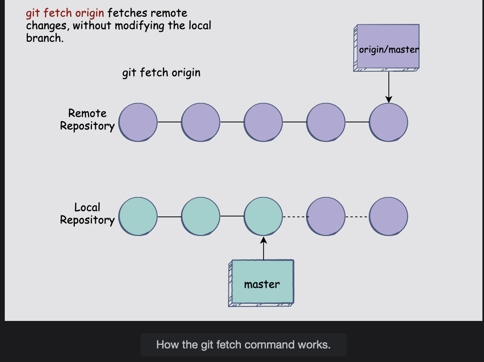

# Git Fetch

Let's take a look at the git fetch command in this lesson.

## The git fetch command

**git fetch is used to download the updated changes from a remote repository.**  
 If you are working in a collaborative environment and want to see how other people might have updated the remote repository between now and the last time you viewed it, you will need to use the git fetch command.

The benefit of git fetch is that **it merely downloads the latest changes and does not affect your local codebase and updates.**  
 The git fetch command is useful if you want to know how the remote repository has changed but don’t want those changes to alter your local setup.

> For example, let’s say you are working on the master branch, and in the meantime, other collaborators have made a few changes to the remote repository. You want to take a look at those changes but don’t want them to interfere with your branch just yet.  
>  Therefore, you can use the following command:
>
>           git fetch origin
>
> origin, in this case, is the name of the remote repository.
>
> You will be able to view the updated commit history and the latest commits as well.

Once you’ve decided to merge those changes with your local master branch, you can use the following command:

        git merge origin/master

The git merge origin/master command will make sure that the latest changes in the remote branch are merged with the local version of the branch as well.

Here is a visual representation so you can form a better mental model of what happens when you fetch a branch from a remote repository:

---

        git branch

Notice that you are currently on the master branch.

        git fetch origin master

Followed by:

        git merge origin master

The **Already up-to-date** message means that the local branch and the remote one have np pending changes and are identical.
