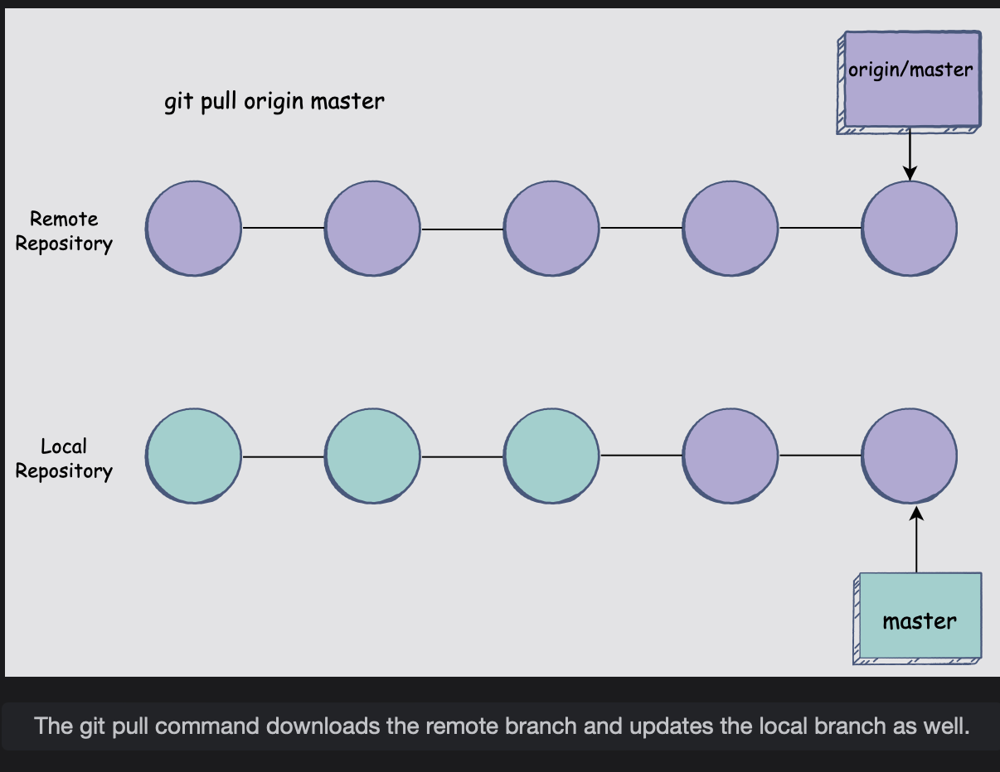
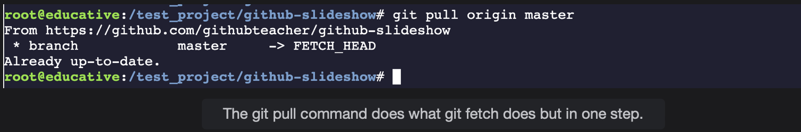

# Git Pull

This lesson discusses the git pull command and how you can make use of it.

## The git pull command

Similar to git fetch, **the git pull command also downloads the latest updates from the remote repository.**  
 In many ways, it does what git fetch also does but with the **added function of merging the newly downloaded remote repository with the latest commits into the local version** of the branch.

> Let’s say you’ve been working on creating a new feature for your project on a branch with another team member.  
>  Both you and the teammate have been working tirelessly, and making changes and committing them regularly.  
>  There will be countless times when you will need to make sure that your branch is in sync with your teammate’s branch.
>
> Both of you will push your commits to the remote repository and pull each other’s changes. This is where the git pull command comes in handy.
>
>           git pull origin branch_name
>
> The command above will download the latest changes from the remote repository and merge them into your local branch, ultimately updating your branch HEAD to point to the latest commit in that branch.
>
> Here is an example of how the git pull command works:
>
> 

You will **notice an immediate difference between how the git fetch command worked and how the git pull command downloaded the remote branch.**  
 While it took two steps to download and merge the remote branch, you got the very same result with only one command using git pull.

While the **git fetch command only downloaded the remote branch, the git pull command downloaded and merged the remote branch into the local one as well.**  
 This is the expected output you should get when you enter the git pull command:

Once again, The Already up-to-date message means that the local branch and the remote one have no pending changes and are identical.
