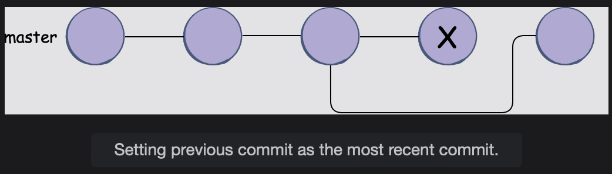

# Reverting to an Earlier Commit

Let's learn how to reset changes made to a remote repository in this lesson.

> Remember the git reset command which is useful in cases where you want to undo a recent change?  
>  Well, it is only useful when you wish to make changes to your commit history locally.  
>  However, **this command is not helpful if we have pushed our commits to a remote repository.**
>
> Changing the commit history on a remote repository will result in a history conflict with everyone who has a clone of that repository. The remote commit history will begin to differ from theirs.

We can add a new commit to the remote repository that contains content from an older commit instead of the commit which contains any mistakes to address this issue.

## The git revert command

In order to set an old commit, which is free from any know flaw, and have it set as our latest commit, we can use the following command:

        git revert HEAD~1

**git revert** will add another commit on top of the commit that contains flaws in your code.
