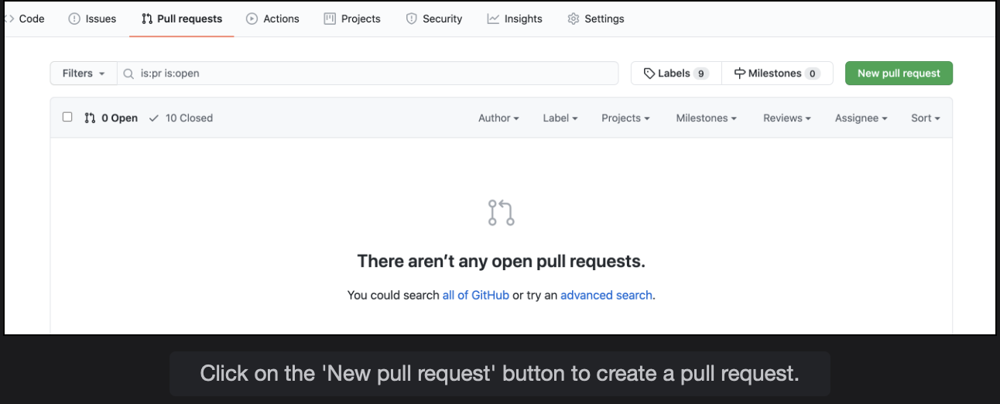
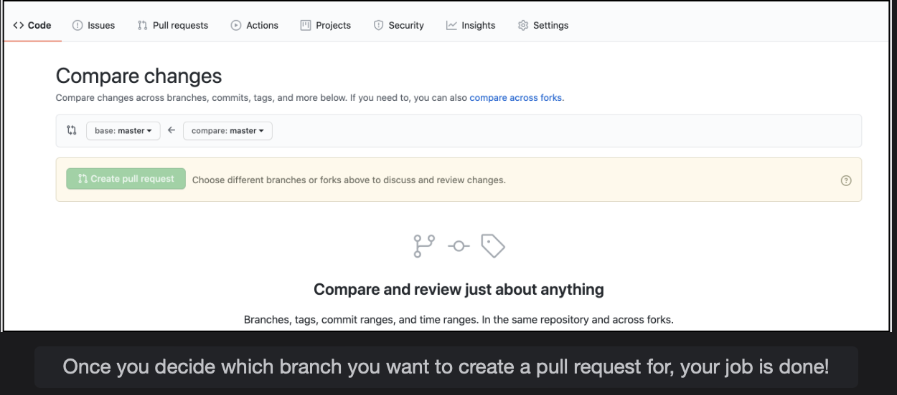
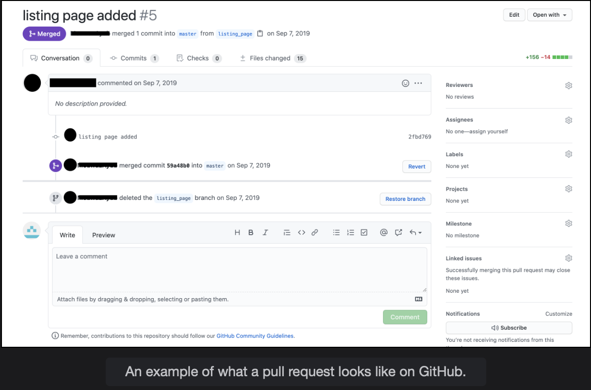
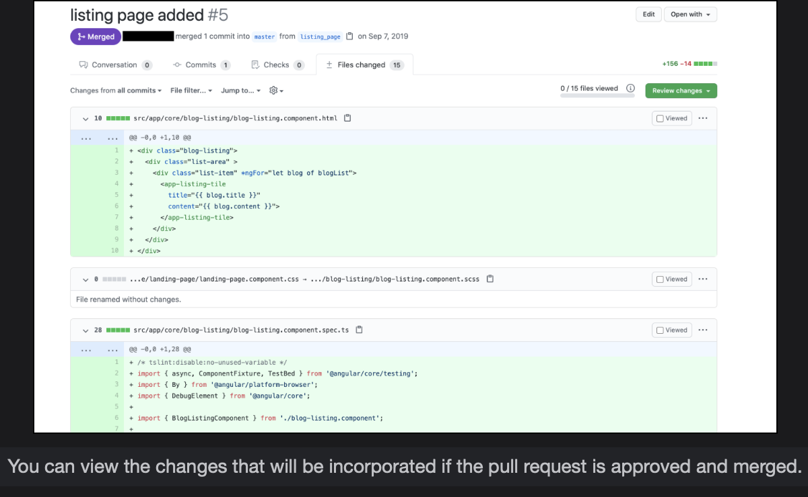

# Pull Requests

Let's learn about pull requests and how useful they can be when working with a team.

## What are pull requests

> Pull requests are a **way to formally contribute to a project without disrupting the workflow of the other team members** and also **a way to maintain a check and balance of the contributions added to the project source code**.
>
> Platforms such as GitHub have a straightforward and convenient way to create pull requests. These allow other contributors to review and evaluate your submitted work and provide comments and suggestions accordingly.
>
> - Go over to the project repository on GitHub
> - Switch to the pull requests tab
> - Click on the ‘New pull request’ button on the top right
>
>   
>
> - Select the appropriate base branch (the branch with which the other one is meant to be merged) and the branch you want to compare changes with
>
>   
>
> And that's it! You've created your own pull request!

Think of **pull requests as the intermediate step before you can merge your contribution into the source code.**  
 Pull requests **serve as barriers for the source code not to be polluted with modifications that are not vetted.**  
 Once the pull request is approved, the changes in the pull request are merged with the source code.

Pull requests are a **user-friendly way of keeping a record of all the modifications that your project’s source code goes through,** the discussions that took place regarding the proposed changes, and also who the responsible stakeholders were for each change that was incorporated.

## Pull requests are not restricted to Git

Pull requests aren’t specific to Git, and there is no special command that is used to create pull requests.

They are simply a method or process that is **extremely beneficial to developers working on projects with teams or for open source projects.**  
 You can create pull requests on GitHub, Bitbucket, or any other similar platform.

## Pull requests have several functions

The image provided above shows the GitHub page for a pull request.

- The pull request displays the list of commits that will be merged and also displays the branch that will be merged and the branch with which the other branch will be merged. In this case, the branch task/user-posts-in-newsfeed will be merged with master.
- The pull requests page allows contributors and reviewers to start a discussion by adding comments and details regarding the changes proposed.
- You can ask other contributors to review your pull requests. Pull requests make the following tasks easier, quicker, and better documented:
  - Merge the changes in the pull request
  - Approve the pull request
  - Request more changes
  - Close the pull request without merging the branch if the proposed changes aren’t needed
- Pull requests also allow you to view the entire list of commits and who made the commit.
- Pull requests also allow you to view the files that will be changed and how they will be changed in a convenient manner. Each line of code is colored, which represents whether that line was added, deleted, or was left unchanged.  
   The green color shows that the new line was inserted, and a red-colored line would mean the line is meant to be removed. Here is a view of how that looks:

